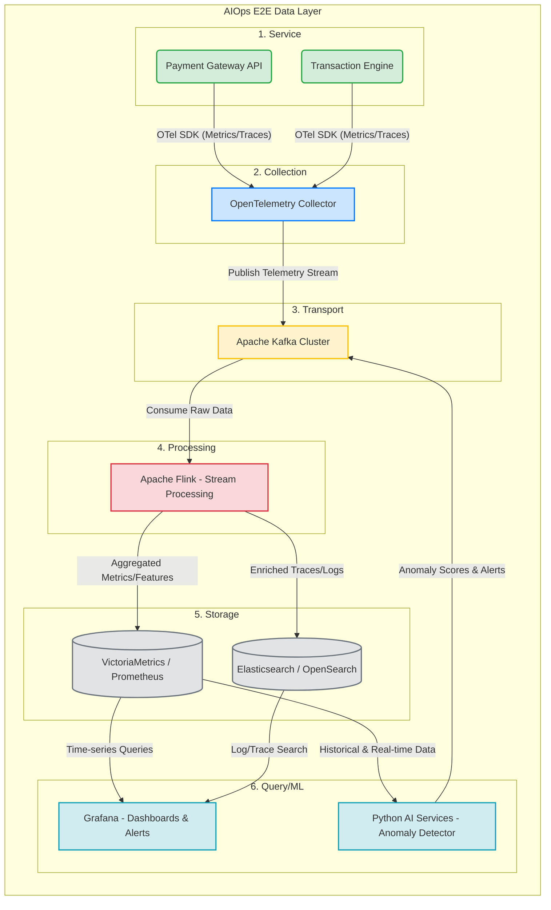

# E2E Data Layer Architecture

**Use case:** Anomaly Detection trên Payment Service

### Chi tiết các Tools được lựa chọn:
1. **Service**: Các Microservices về thanh toán (Ví dụ được build bằng Spring Boot hoặc Golang).
2. **Collection**: **OpenTelemetry (OTel) Collector** (Thu thập metrics tỷ lệ lỗi thanh toán, độ trễ và traces).
3. **Transport**: **Apache Kafka** (Làm message broker trung tâm chịu tải cao, buffer dữ liệu chống nghẽn).
4. **Processing**: **Apache Flink** (Xử lý stream thời gian thực, rolling windows để tính tỉ lệ lỗi, extract các time-series features cho ML).
5. **Storage**: 
    - **VictoriaMetrics** (Lưu trữ Time-series metrics do Flink tính toán/đẩy ra).
    - **Elasticsearch** (Lưu các logs và raw traces lỗi để truy xuất khi có cảnh báo).
6. **Query/ML**: 
    - **Grafana** (Visualization hệ thống payment, truy xuất metrics và logs, hiển thị cảnh báo).
    - **Python AI Services / MLflow** (Triển khai mô hình Machine Learning như Isolation Forest, LSTM để phát hiện Anomaly. Mô hình lấy dữ liệu metrics từ VictoriaMetrics và đẩy ngược cảnh báo nếu phát hiện bất thường thanh toán về Kafka).
